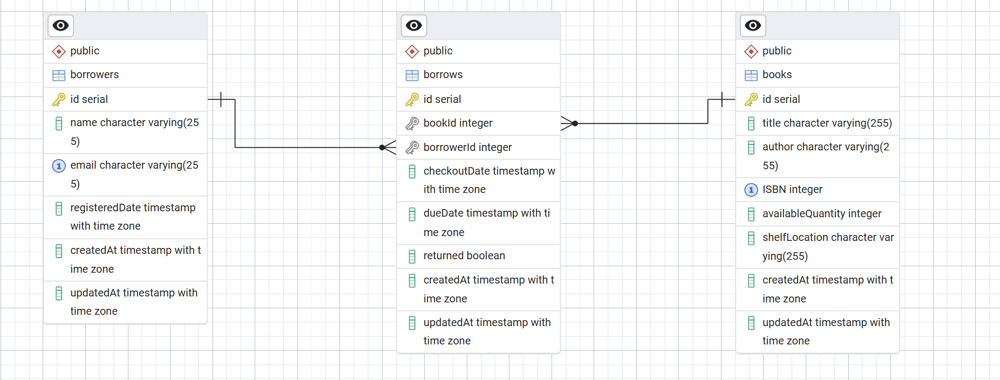

# Library API

Simple library management API with Swagger documentation.

## Quick Start

1. Install dependencies: `npm install`
2. Start server: `npm start`
3. View API docs: `http://localhost:3000/api-docs`

## API Endpoints

### Books

- `GET /API/books/books` - Get all books
- `POST /API/books/books` - Add a book
- `PUT /API/books/books/:id` - Update a book
- `DELETE /API/books/books/:id` - Delete a book

### Borrowers

- `POST /API/users/borrowers` - Register borrower
- `PUT /API/users/borrowers/:id` - Update borrower
- `DELETE /API/users/borrowers/:id` - Delete borrower
- `GET /API/users/borrowers` - List borrowers

### Borrowing

- `POST /API/borrow/borrow` - Borrow a book
- `POST /API/borrow/return` - Return a book
- `GET /API/borrow/borrower/:id/books` - Get borrower's books
- `GET /API/borrow/books/overdue` - Get overdue books

### ERD Diagram 

