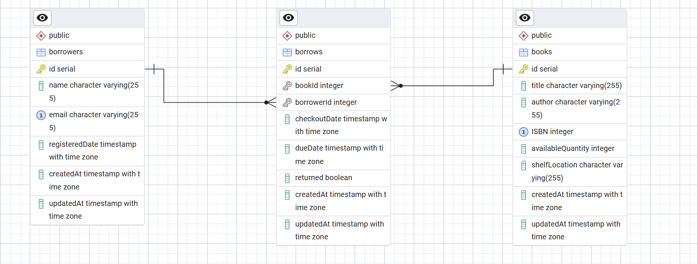

# Library API

Simple library management API with Swagger documentation with Expected Input and Output.

## Quick Start

1. Install dependencies: `npm install`
2. Start server: `npm start`
3. View API docs: `http://localhost:3000/api-docs`

## Technologies Used

- **Express.js**: Web framework for handling HTTP requests and routing.
- **Sequelize**: ORM for database management, query sanitization, and prevention of SQL injection.
- **Swagger**: API documentation and testing interface.
- **Jest**: Unit testing framework.
- **Supertest**: HTTP assertions for API testing.

## Security

- **Sequelize** is used for all database queries, which automatically sanitizes inputs and helps prevent SQL injection attacks.
- **Validation Middleware**: Ensures all incoming data is validated before processing.
- **Rate Limiting**: Protects endpoints from abuse and excessive requests.

## Features

- RESTful API for managing books, users, and borrowing processes
- Swagger UI for interactive API documentation
- CSV export for analytical reports
- Unit tests for reliability

### ERD Diagram



## API Endpoints

### Books

- `GET /API/books/books` - Get all books
- `POST /API/books/books` - Add a book
- `PUT /API/books/books/:id` - Update a book
- `DELETE /API/books/books/:id` - Delete a book

### Borrowers

- `POST /API/users/borrowers` - Register borrower
- `PUT /API/users/borrowers/:id` - Update borrower
- `DELETE /API/users/borrowers/:id` - Delete borrower
- `GET /API/users/borrowers` - List borrowers

### Borrowing

- `POST /API/borrow/borrow` - Borrow a book
- `POST /API/borrow/return` - Return a book
- `GET /API/borrow/borrower/:id/books` - Get borrower's books
- `GET /API/borrow/books/overdue` - Get overdue books

## Running Tests

Unit tests are written using **Jest** and **Supertest**. To run the tests:

```bash
npm test
```

Or, if you want to use Jest directly:

```bash
npx jest
```

Test files are located in the `tests/` directory. Example: `tests/book.controller.test.js`
